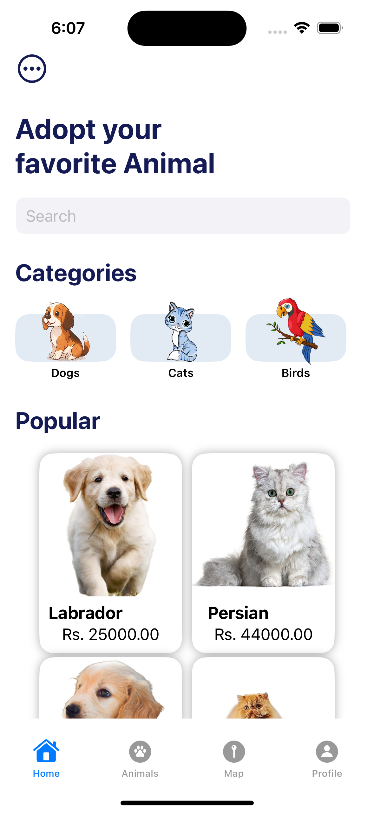
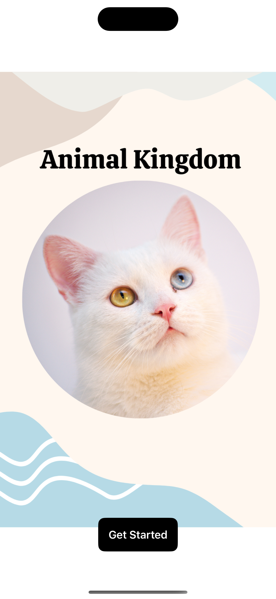
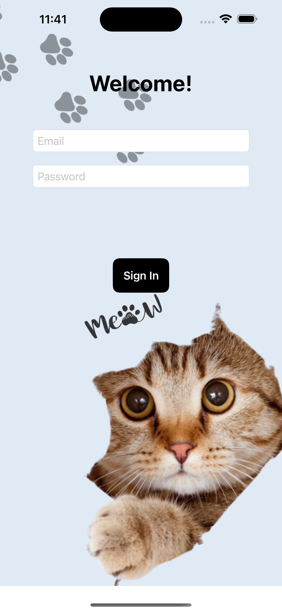
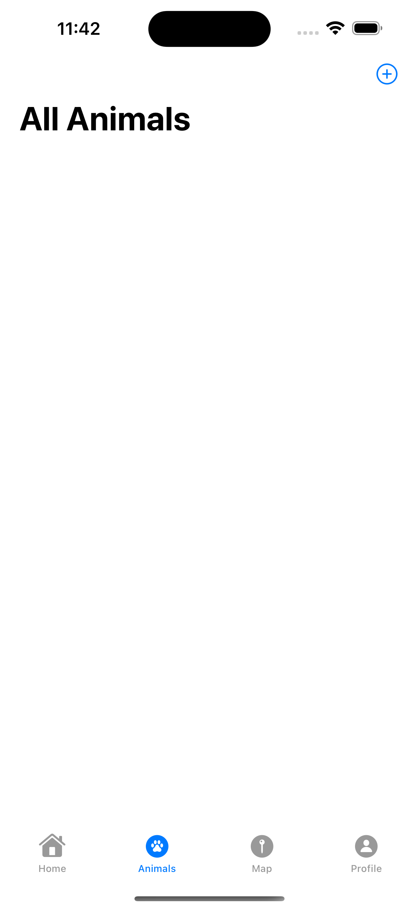

Please go under edit and edit this file as needed for your project.  There is no seperate documentation needed.

# Project Name - Animal Kingdom
# Student Id - IT20668136
# Student Name - Hettiarachchi H A T T

#### 01. Brief Description of Project - The Animal Kingdom mobile application is a dedicated platform for buying and selling various types of animals, including cats, dogs, fish, and parrots. Designed with user convenience in mind, it provides a seamless and user-friendly interface for browsing through available animal listings, adding and editing advertisements, reading detailed information about animals, and deleting ads when necessary.

Additionally, the app features a search function that allows users to find animal shops across Sri Lanka. Users can search for specific types of animals or discover different shops in their area. This functionality aims to connect animal enthusiasts with reputable sellers and promote ethical animal trading practices.

The Animal Kingdom app makes it easy for users to find their desired pets or connect with suitable buyers for animals they wish to sell. By ensuring a secure and efficient experience for both buyers and sellers, the app fosters a vibrant community of animal lovers in Sri Lanka. It offers a comprehensive solution for animal trading, promoting responsible pet ownership, and connecting enthusiasts across the country

#### 02. Users of the System - 
Pet Buyers-

Individuals looking to buy pets such as cats, dogs, fish, or parrots.
Users who want to browse listings to find their desired pets.
Pet enthusiasts searching for specific breeds or types of animals.

Pet Sellers-

Individuals or businesses looking to sell pets.
Users who need to create, edit, or delete advertisements for animals they want to sell.

Animal Shops-

Pet stores and animal shops looking to advertise their animals and reach potential buyers.
Shops that want to increase their visibility to animal enthusiasts in Sri Lanka.

General Users-
Animal lovers who want to explore various animal listings.
Users interested in learning more about different types of pets available in the market.

#### 03. What is unique about your solution -
The Animal Kingdom app offers comprehensive animal listings, a user-friendly interface, detailed animal information, advanced search features, and promotes responsible trading practices. It fosters a vibrant community of animal enthusiasts, ensures secure transactions, and connects users with reputable sellers, creating a trustworthy marketplace in Sri Lanka.

#### 04. Briefly document the functionality of the screens you have (Include screen shots of images)

  
The Search Screen enables users to find specific types of animals or animal shops. Users can enter keywords, select filters, and sort results by relevance or date. This screen helps users quickly locate animals or shops that meet their criteria, enhancing their browsing experience.
 
The Home Screen is the entry point of the Animal Kingdom app, providing an overview of featured animal listings and quick access to different sections of the app
 
welcome page and logging 
 
The Animal Listings Screen displays a list of animals available for sale. Each listing includes a photo, name, breed, age, and price of the animal.
 
The User Profile Screen displays user-specific information, including contact details, saved favorites, and a history of their listings. Users can manage their account settings

#### 05. 

add animal 

 Text("Add New Animal")
                .font(.system(size: 30, weight: .bold))
                .foregroundColor(Color(UIColor(red: 0.08, green: 0.11, blue: 0.33, alpha: 1.0)))
                .padding(.leading, 36)
                  Section {
                        HStack {
                            Text("Animal Name : ")
                            TextField("Enter Animal Name", text: $name)
                        }
                        HStack {
                            Text("Animal Breed :")
                            TextField("Enter Animal Breed", text: $breed)
                        }
                        HStack {
                          Text("Gender : ")
                              Spacer()

                          Picker("", selection: $gender) {
                            Text("Male").tag("Male")
                            Text("Female").tag("Female")
                            }

                          .pickerStyle(.segmented)
                        }
                        HStack {
                            Text("Animal Location :")
                            TextField("Enter Animal Location", text: $location)
                        }
                        HStack {
                            Text("Animal Age :")
                            TextField("Enter Animal Age", text: $age)
                        }
                        HStack {
                            Text("Animal Description :")
                            TextField("Enter Description", text: $animaldesc)
                        }
                        DatePicker("Date of Birth :", selection: $selectedDate, displayedComponents: .date)
                       
                        HStack {
                            Text("Enter Price :")
                            TextField("Enter Price", text: $price)
                        }
                        HStack {
                            Text("Select Weight : \(Int(weight))")
                            Slider(value: $weight, in: 0...100, step: 5)
                        }
                        HStack {
                
                            Spacer()
                           
                            //MARK: PhotoPicker
                            PhotosPicker(selection: $selectedItems,
                                         maxSelectionCount: 1,
                                         matching: .images) {
                                if !selectedimage.isEmpty, let uiImage = UIImage(data: selectedimage) {
                                    Image(uiImage: uiImage)
                                        .renderingMode(.original)
                                        .resizable()
                                        .frame(width: 200, height: 200)
                                        .cornerRadius(8)
                                        .shadow(radius: 5)
                                } else {
                                    Image(systemName: "photo")
                                        .resizable()
                                        .frame(width: 100, height: 100)
                                        .cornerRadius(8)
                                        .shadow(radius: 5)
                                        .foregroundColor(.gray)
                                    
                                }
                            }
                            //MARK: PhotoPicker
                            Spacer()
                        }
                        //MARK: HStack
                        .onChange(of: selectedItems) { newItems in
                            guard let items = newItems.first else { return }
                            items.loadTransferable(type: Data.self) { result in
                                switch result {
                                case .success(let data):
                                    if let data = data {
                                        selectedimage = data
                                    } else {
                                        print("No data :(")
                                    }
                                case .failure(let error):
                                    fatalError("\(error)")
                                }
                            }
                        }
                    }

#### 06. UI Components used

Header Bar
Details Section
Text Input Fields
Submit Button
Image Upload Field
UIButton
UIViewController
UINavigationController 

#### 07. Testing carried out

   func testExample() {
        
        let app = XCUIApplication()
        app.launch()

        app.buttons["Get Started"].tap()
        app.textFields["Email"].tap()
        
        let passwordSecureTextField = app.secureTextFields["Password"]
        passwordSecureTextField.tap()
        passwordSecureTextField.tap()
        app.buttons["Sign In"].tap()
        app.tabBars["Tab Bar"].buttons["Animals"].tap()
        
        app.navigationBars["All Animals"]/*@START_MENU_TOKEN@*/.buttons["Add Animal"]/*[[".otherElements[\"Add Animal\"].buttons[\"Add Animal\"]",".buttons[\"Add Animal\"]"],[[[-1,1],[-1,0]]],[0]]@END_MENU_TOKEN@*/.tap()
        
        let collectionViewsQuery = app.collectionViews
        let enterAnimalNameTextField = collectionViewsQuery/*@START_MENU_TOKEN@*/.textFields["Enter Animal Name"]/*[[".cells.textFields[\"Enter Animal Name\"]",".textFields[\"Enter Animal Name\"]"],[[[-1,1],[-1,0]]],[0]]@END_MENU_TOKEN@*/
        enterAnimalNameTextField.tap()
        enterAnimalNameTextField.tap()
        
        let enterAnimalBreedTextField = collectionViewsQuery/*@START_MENU_TOKEN@*/.textFields["Enter Animal Breed"]/*[[".cells.textFields[\"Enter Animal Breed\"]",".textFields[\"Enter Animal Breed\"]"],[[[-1,1],[-1,0]]],[0]]@END_MENU_TOKEN@*/
        enterAnimalBreedTextField.tap()
        enterAnimalBreedTextField.tap()
        
        let enterAnimalLocationTextField = collectionViewsQuery/*@START_MENU_TOKEN@*/.textFields["Enter Animal Location"]/*[[".cells.textFields[\"Enter Animal Location\"]",".textFields[\"Enter Animal Location\"]"],[[[-1,1],[-1,0]]],[0]]@END_MENU_TOKEN@*/
        enterAnimalLocationTextField.tap()
        enterAnimalLocationTextField.tap()
        
        let enterAnimalAgeTextField = collectionViewsQuery/*@START_MENU_TOKEN@*/.textFields["Enter Animal Age"]/*[[".cells.textFields[\"Enter Animal Age\"]",".textFields[\"Enter Animal Age\"]"],[[[-1,1],[-1,0]]],[0]]@END_MENU_TOKEN@*/
        enterAnimalAgeTextField.tap()
        enterAnimalAgeTextField.tap()
        
        let enterDescriptionTextField = collectionViewsQuery/*@START_MENU_TOKEN@*/.textFields["Enter Description"]/*[[".cells.textFields[\"Enter Description\"]",".textFields[\"Enter Description\"]"],[[[-1,1],[-1,0]]],[0]]@END_MENU_TOKEN@*/
        enterDescriptionTextField.tap()
        enterDescriptionTextField.tap()
        
        let enterPriceTextField = collectionViewsQuery/*@START_MENU_TOKEN@*/.textFields["Enter Price"]/*[[".cells.textFields[\"Enter Price\"]",".textFields[\"Enter Price\"]"],[[[-1,1],[-1,0]]],[0]]@END_MENU_TOKEN@*/
        enterPriceTextField.tap()
        enterPriceTextField.tap()
        collectionViewsQuery/*@START_MENU_TOKEN@*/.buttons["Save"]/*[[".cells.buttons[\"Save\"]",".buttons[\"Save\"]"],[[[-1,1],[-1,0]]],[0]]@END_MENU_TOKEN@*/.tap()
        
       
                
    }

#### 08. Documentation 

(a) Design Choices
The Animal Kingdom app is built with a user-centered design, prioritizing ease of use and accessibility. The interface is intuitive, catering to users of all ages and technical backgrounds, ensuring a smooth and enjoyable experience. Comprehensive animal listings are included, offering detailed information on each animal to aid users in making informed decisions. Advanced search and filter functionalities allow users to quickly find specific animals or shops in their vicinity. Robust security measures are integrated to protect user data and facilitate safe transactions. Additionally, features that encourage community engagement, such as reviews and forums, are incorporated to build a supportive network of animal enthusiasts. The app's responsive design ensures consistent performance across various devices, from smartphones to tablets.

(b) Implementation Decisions
The technology stack for the Animal Kingdom app includes React Native for cross-platform mobile development, Node.js for backend operations, and MongoDB for scalable data management. Secure authentication methods using JWT (JSON Web Tokens) manage user sessions and protect sensitive information. RESTful APIs are developed to ensure efficient communication between the mobile app and server, facilitating smooth data retrieval and updates. A NoSQL database like MongoDB handles the diverse and dynamic nature of animal listings and user interactions. Reliable payment gateway integration is implemented to manage secure transactions, providing users with multiple payment options. Rigorous testing procedures, including unit, integration, and user acceptance tests, are conducted to ensure the app's functionality and user satisfaction.

(c) Challenges
Maintaining accurate and up-to-date information in animal listings can be challenging. 
Designing the app to handle an increasing number of users and listings without compromising performance
Protecting user data and ensuring secure transactions is critical
Encouraging user participation and fostering a sense of community within the app can be difficult

#### 09. Reflection

Understanding and defining the project's scope required thorough analysis
Maintaining a consistent design across all screens required meticulous attention to detail and frequent revisions.
ntegrating comprehensive features while ensuring the app

  

